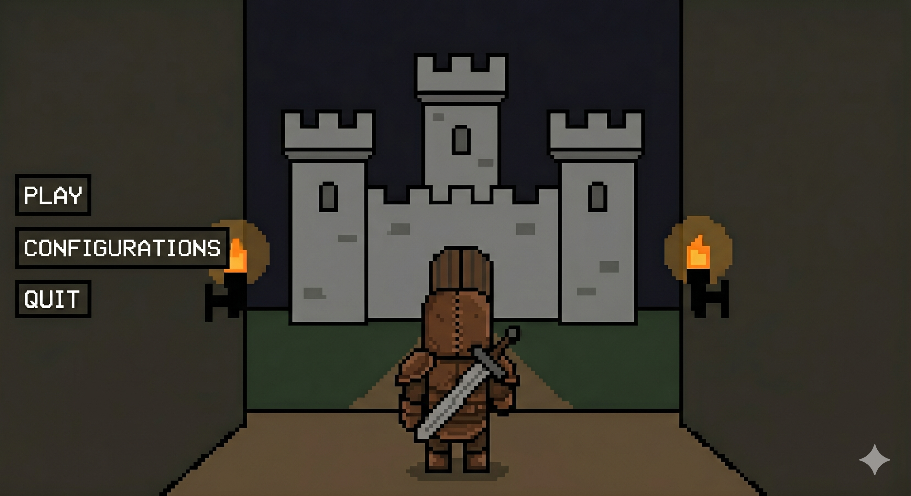
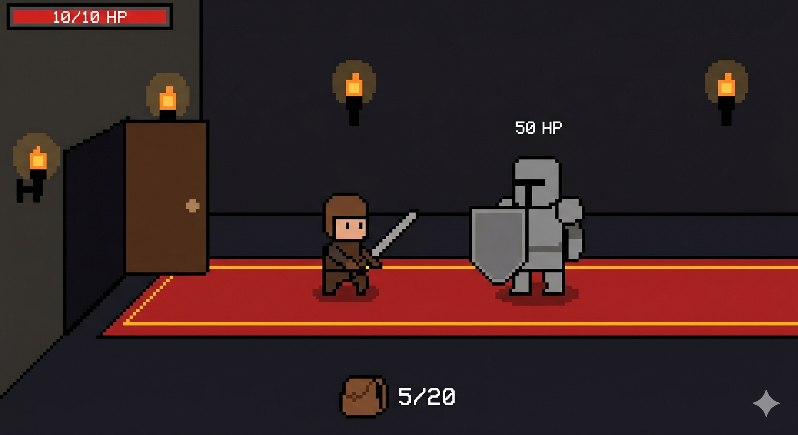
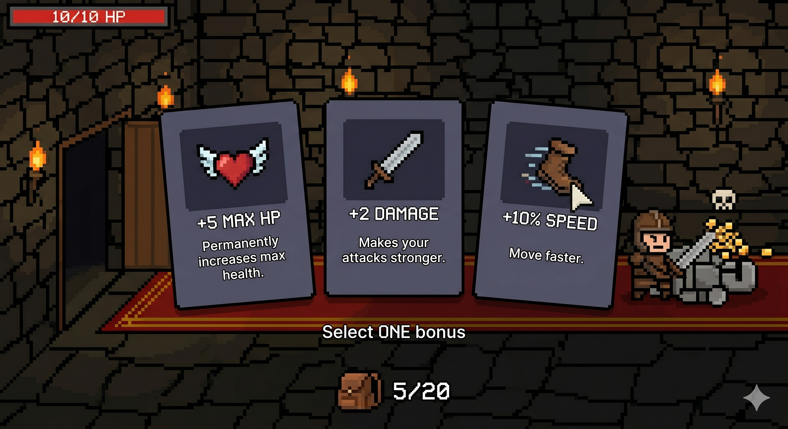

# DESIGN.md — Knight of Hope

**Integrantes:** Bastian Contreras · Ignacio Ovalle  
**Repositorio:** https://github.com/Bazzty/Knight-of-hope  

---

## 1. Descripción del juego

**Knight of Hope** es un juego roguelite 2D de vista lateral que corre completamente en el navegador. El jugador controla a un caballero que, harto de la crueldad e injusticia del mundo, desciende a las catacumbas de la humanidad para enfrentarse a los males que causaron la caída de la antigua sociedad.

El caballero avanza por habitaciones generadas aleatoriamente, enfrenta enemigos y elige mejoras de estadísticas o armas al limpiar cada habitación. Si muere, vuelve al inicio (loop roguelite).

### Mecánicas principales

| Elemento | Descripción |
|---|---|
| **Caballero** | Se mueve con teclado (WASD / flechas), ataca con espada (clic o tecla) |
| **Habitaciones** | Al entrar aparecen enemigos aleatorios; al eliminarlos todos se abre la siguiente |
| **Enemigos** | Distintos tipos con comportamientos simples: patrullar, perseguir, disparar |
| **Mejoras** | Al limpiar una habitación, el jugador elige 1 de 3 mejoras (más vida, más daño, velocidad de ataque) |
| **Game Over** | Si el caballero muere, vuelve al inicio |

### Pantallas del juego

| Pantalla | Descripción |
|---|---|
| **Menú principal** | Título del juego, botón Jugar, instrucciones básicas |
| **Juego** | Canvas con el caballero, enemigos, habitación activa y HUD (vida, nivel) |
| **Mejoras** | Al limpiar habitación: muestra 3 cartas de mejora para elegir |
| **Game Over** | Muestra estadísticas de la run y botón para reiniciar |

---

## 2. Mockups de las pantallas principales

### Menú Principal
Pantalla de inicio con opciones de juego. El caballero aparece de espaldas frente al castillo.



### Pantalla de Juego (HUD)
Vista lateral del combate. Se muestra la barra de HP del jugador, los enemigos con su HP, y la puerta de salida a la siguiente habitación.



### Pantalla de Mejoras
Al limpiar una habitación aparecen 3 cartas para elegir: +5 MAX HP, +2 DAMAGE, +10% SPEED.



### Pantalla de Game Over
_(Pendiente de mockup — se mostrará al morir el caballero con estadísticas de la run y botón de reinicio)_

---

## 3. Stack tecnológico

| Herramienta | Rol | Justificación |
|---|---|---|
| **Vue 3** | Framework UI | Maneja todas las pantallas no-juego (menú, mejoras, game over, HUD). Componentes reactivos y Composition API |
| **Phaser 3** | Motor de juego | Framework 2D para navegador: game loop, física arcade, sprites, colisiones, animaciones |
| **Vite** | Bundler / Dev server | Hot module replacement instantáneo, build optimizado para producción |
| **pnpm** | Gestor de paquetes | Requerido por la solemne; más rápido y eficiente que npm |
| **Pinia** | State management | Store compartido entre Vue y Phaser (vida del jugador, nivel, mejoras activas) |
| **Vitest** | Testing | Pruebas unitarias de la lógica del juego sin abrir el navegador |
| **ESLint** | Linter | Detecta errores de estilo; bloquea el pipeline CI/CD si falla |
| **Docker + nginx** | Contenedor | Empaqueta la app para que corra igual en cualquier máquina |
| **GitHub Actions** | CI/CD | Ejecuta lint + tests + build + push a DockerHub en cada push |

---

## 4. Estructura de carpetas propuesta

```
Knight-of-hope/
├── .github/
│   └── workflows/
│       └── main.yml          # GitHub Actions CI/CD
├── public/
│   └── assets/               # sprites, audio, fuentes
├── src/
│   ├── components/           # pantallas Vue
│   │   ├── MenuScreen.vue
│   │   ├── GameScreen.vue
│   │   ├── UpgradeScreen.vue
│   │   └── GameOver.vue
│   ├── game/                 # lógica Phaser
│   │   ├── scenes/
│   │   │   ├── GameScene.js
│   │   │   └── UIScene.js
│   │   ├── entities/
│   │   │   ├── Player.js
│   │   │   └── Enemy.js
│   │   ├── rooms/
│   │   │   └── RoomManager.js
│   │   └── config.js
│   ├── store/
│   │   └── gameStore.js      # estado compartido Vue ↔ Phaser
│   ├── App.vue
│   └── main.js
├── tests/
│   └── unit/
│       ├── player.test.js
│       └── upgrades.test.js
├── Dockerfile
├── .gitignore
├── DESIGN.md
├── PLANNING.md
├── README.md
├── package.json
├── pnpm-lock.yaml
└── vite.config.js
```

---

## 5. Dependencias principales

```json
{
  "dependencies": {
    "vue": "^3.4.x",
    "phaser": "^3.80.x",
    "pinia": "^2.1.x"
  },
  "devDependencies": {
    "vite": "^5.x",
    "@vitejs/plugin-vue": "^5.x",
    "vitest": "^1.x",
    "eslint": "^8.x",
    "eslint-plugin-vue": "^9.x"
  }
}
```
