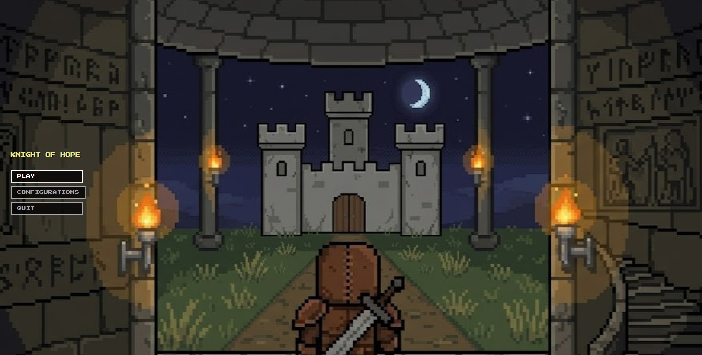
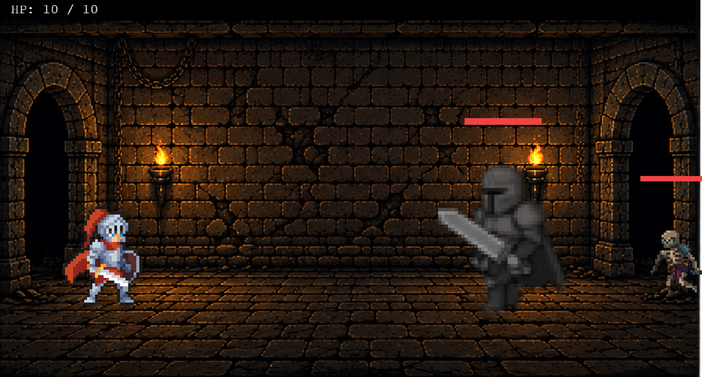
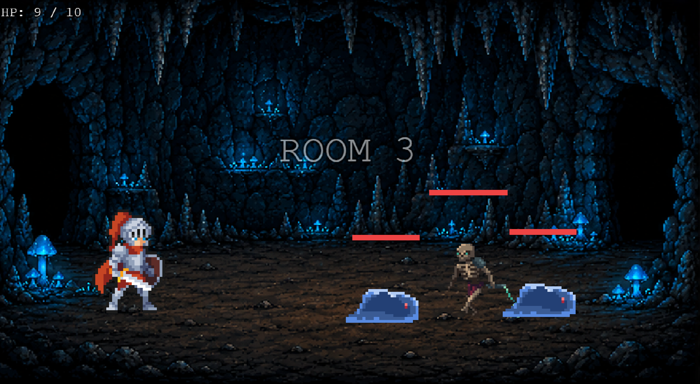
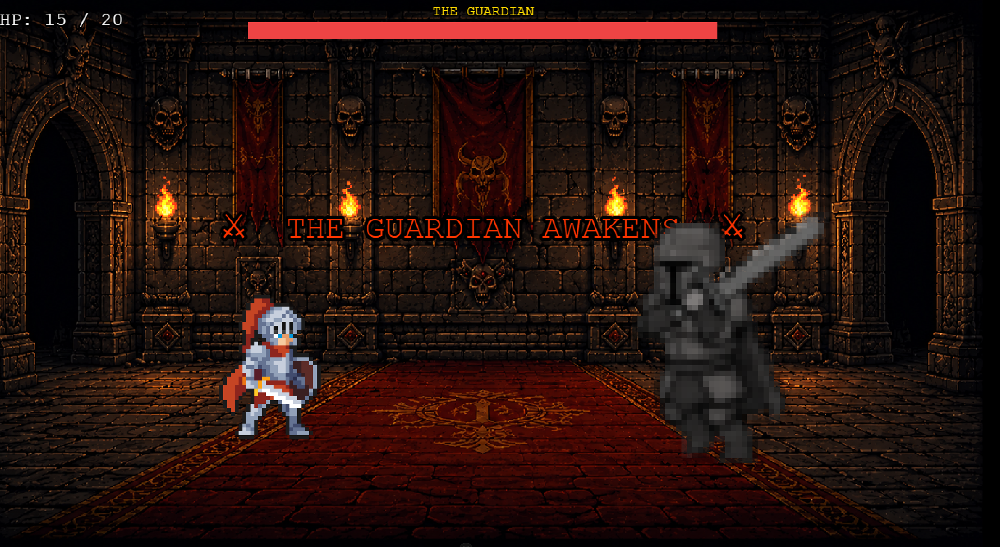

# Knight of Hope

A knight, fed up with cruelty, injustice, and power, challenges his own abilities by venturing into the catacombs of humanity, which hold the terrible reasons for the decline of ancient society.

A 2D roguelite game built with Phaser 4 and Vue 3. Fight through dungeon rooms, defeat enemies, and choose upgrades between battles.

**Team:** [Bastian Contreras](https://github.com/Bazzty), [Ignacio Ovalle](https://github.com/iovalleh21)

---

## Screenshots

| Menu | Room 1 |
|------|--------|
|  |  |

| Room 3 | Boss |
|--------|------|
|  |  |

---

## Stack

- **Vue 3** — UI shell and navigation
- **Phaser 4** — game engine
- **Vite** — bundler
- **Pinia** — state management between scenes
- **pnpm** — package manager

---

## Getting Started

### Requirements

- Node.js 22+
- pnpm

### Install dependencies

```bash
pnpm install
```

### Run in development

```bash
pnpm dev
```

Open `http://localhost:5173`

### Run tests

```bash
pnpm test:unit
```

### Build for production

```bash
pnpm build
```

---

## Run with Docker

### Build and start (local)
```bash
docker compose up --build
```
Open `http://localhost:8080`

### Stop (local)
```bash
docker compose down
```

### Pull and run from DockerHub
```bash
docker run -d -p 8080:80 --name knight-of-hope bazzty/knight-of-hope:latest
```
Open `http://localhost:8080`

### Stop DockerHub container
```bash
docker stop knight-of-hope
docker rm knight-of-hope
```

---

## CI/CD

GitHub Actions runs on every push:

1. Install dependencies
2. Run unit tests
3. Build the project
4. On merge to `main`: build Docker image and push to DockerHub
